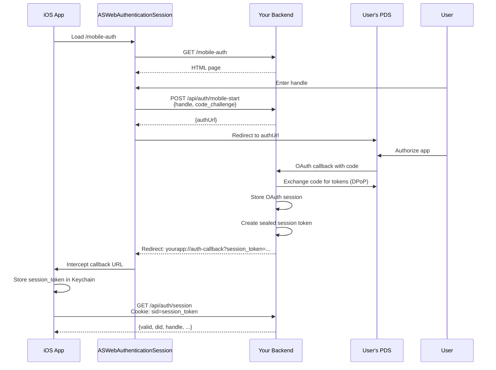

# Mobile OAuth Guide

**Package**: `@tijs/atproto-oauth-hono` **Version**: 2.3.0

This guide explains how to implement mobile OAuth authentication using the
`@tijs/atproto-oauth-hono` package with AT Protocol.

## Table of Contents

- [Architecture Overview](#architecture-overview)
- [OAuth Flow](#oauth-flow)
- [API Endpoints](#api-endpoints)
- [Data Types](#data-types)
- [Error Handling](#error-handling)
- [Security Considerations](#security-considerations)
- [Integration Examples](#integration-examples)

---

## Architecture Overview

The mobile OAuth implementation follows the **Backend-for-Frontend (BFF)**
pattern:

- **DPoP tokens** are managed entirely on the backend
- **Session tokens** are sealed using Iron Session encryption
- **Mobile app** stores only the sealed session token (no raw OAuth tokens)
- **Cookie-based authentication** for all API calls after initial OAuth

### Key Components

1. **Mobile Auth Page**: `/mobile-auth` - HTML page loaded in
   ASWebAuthenticationSession
2. **OAuth Start**: `POST /api/auth/mobile-start` - Initiates OAuth with PKCE
3. **OAuth Callback**: `GET /oauth/callback` - Completes OAuth and redirects to
   app
4. **Session Validation**: `GET /api/auth/session` - Validates and extends
   sessions
5. **Token Refresh**: `GET /mobile/refresh-token` - Refreshes session tokens

---

## OAuth Flow



---

## API Endpoints

### 1. Mobile Auth Page

**`GET /mobile-auth`**

Loads the OAuth initialization page in ASWebAuthenticationSession.

#### Request

```http
GET /mobile-auth HTTP/1.1
Host: your-app.com
```

#### Response

```http
HTTP/1.1 200 OK
Content-Type: text/html

<!DOCTYPE html>
<html>
  <!-- Interactive OAuth form -->
</html>
```

#### Description

This HTML page:

- Prompts user for their Bluesky handle
- Generates PKCE code_challenge on client side
- Calls `/api/auth/mobile-start` to initiate OAuth
- Redirects to PDS authorization URL

---

### 2. Start Mobile OAuth

**`POST /api/auth/mobile-start`**

Initiates OAuth flow with PKCE for mobile clients.

#### Request

```http
POST /api/auth/mobile-start HTTP/1.1
Host: your-app.com
Content-Type: application/json

{
  "handle": "alice.bsky.social",
  "code_challenge": "E9Melhoa2OwvFrEMTJguCHaoeK1t8URWbuGJSstw-cM"
}
```

**Request Body Schema**

| Field            | Type   | Required | Description                                                            |
| ---------------- | ------ | -------- | ---------------------------------------------------------------------- |
| `handle`         | string | ✅       | User's Bluesky handle (e.g., `alice.bsky.social` or `alice.com`)       |
| `code_challenge` | string | ✅       | PKCE code challenge (SHA-256 hash of code_verifier, base64url encoded) |

#### Success Response

```http
HTTP/1.1 200 OK
Content-Type: application/json

{
  "success": true,
  "authUrl": "https://bsky.social/oauth/authorize?client_id=...&state=...&code_challenge=..."
}
```

**Response Schema**

| Field     | Type    | Description                                            |
| --------- | ------- | ------------------------------------------------------ |
| `success` | boolean | Always `true` on success                               |
| `authUrl` | string  | Authorization URL for user's PDS (to redirect browser) |

#### Error Response

```http
HTTP/1.1 400 Bad Request
Content-Type: application/json

{
  "success": false,
  "error": "Invalid handle"
}
```

**Error Codes**

| Status | Error Message             | Cause                                                       |
| ------ | ------------------------- | ----------------------------------------------------------- |
| 400    | `Invalid handle`          | Missing or malformed handle                                 |
| 400    | `Missing code_challenge`  | Missing PKCE code_challenge                                 |
| 400    | `Couldn't initiate login` | OAuth initialization failed (network, invalid handle, etc.) |

---

### 3. OAuth Callback

**`GET /oauth/callback`**

Handles OAuth authorization callback from user's PDS. Called automatically by
the PDS after user authorizes the app.

#### Request

```http
GET /oauth/callback?code=...&state=... HTTP/1.1
Host: your-app.com
```

**Query Parameters**

| Parameter | Type   | Required | Description                                   |
| --------- | ------ | -------- | --------------------------------------------- |
| `code`    | string | ✅       | OAuth authorization code from PDS             |
| `state`   | string | ✅       | OAuth state (includes mobile flag and handle) |

#### Mobile Success Response

For mobile clients (when `state.mobile === true`):

```http
HTTP/1.1 302 Found
Location: yourapp://auth-callback?session_token=Fe26...&did=did:plc:...&handle=alice.bsky.social
```

**Callback URL Parameters**

| Parameter       | Type   | Always Present | Description                                                 |
| --------------- | ------ | -------------- | ----------------------------------------------------------- |
| `session_token` | string | ✅             | Sealed Iron Session token (store in Keychain)               |
| `did`           | string | ✅             | User's DID (e.g., `did:plc:abc123...`)                      |
| `handle`        | string | ✅             | User's handle (e.g., `alice.bsky.social`)                   |
| `access_token`  | string | ❌             | Raw OAuth access token (optional, not used in BFF pattern)  |
| `refresh_token` | string | ❌             | Raw OAuth refresh token (optional, not used in BFF pattern) |

> **Note**: Mobile apps should only use `session_token` for authentication. The
> `access_token` and `refresh_token` are provided for debugging but should not
> be used directly - all API calls use cookie-based authentication.

#### Error Response

```http
HTTP/1.1 400 Bad Request
Content-Type: text/plain

Login failed: Invalid authorization code
```

---

### 4. Session Validation

**`GET /api/auth/session`**

Validates session and returns user information. Supports both cookie-based (web)
and Bearer token (mobile) authentication.

#### Request (Cookie-based)

```http
GET /api/auth/session HTTP/1.1
Host: your-app.com
Cookie: sid=Fe26.2**...sealed-session-token...**
```

#### Request (Bearer token - Alternative)

```http
GET /api/auth/session HTTP/1.1
Host: your-app.com
Authorization: Bearer Fe26.2**...sealed-session-token...**
```

> **Recommendation**: Use cookie-based authentication. The iOS app should create
> an HTTPCookie with the session_token and add it to HTTPCookieStorage.shared.
> URLSession will automatically include it in all requests.

#### Success Response

```http
HTTP/1.1 200 OK
Content-Type: application/json

{
  "valid": true,
  "did": "did:plc:abc123xyz",
  "handle": "alice.bsky.social",
  "userHandle": "alice.bsky.social",
  "accessToken": "eyJ0eXAiOiJhdCtkcG9wIiwiYWxnIjoiRVMyNTYi...",
  "refreshToken": "eyJhbGciOiJFUzI1NiIsInR5cCI6IkpXVCJ9...",
  "expiresAt": 1734820800000
}
```

**Response Schema**

| Field          | Type    | Description                                               |
| -------------- | ------- | --------------------------------------------------------- |
| `valid`        | boolean | Always `true` on success                                  |
| `did`          | string  | User's DID                                                |
| `handle`       | string  | User's handle                                             |
| `userHandle`   | string  | User's handle (alias for mobile compatibility)            |
| `accessToken`  | string  | OAuth access token (backend-managed, informational only)  |
| `refreshToken` | string  | OAuth refresh token (backend-managed, informational only) |
| `expiresAt`    | number  | Token expiration timestamp (milliseconds since epoch)     |

> **Important**: `accessToken` and `refreshToken` are managed by the backend.
> Mobile clients should NOT use these directly. All authenticated API calls
> should use cookie-based authentication, and token refresh is handled
> automatically by the backend.

#### Error Responses

**Invalid Session**

```http
HTTP/1.1 401 Unauthorized
Content-Type: application/json

{
  "valid": false,
  "error": "Session invalid or expired",
  "reason": "session_invalid"
}
```

**Missing OAuth Data**

```http
HTTP/1.1 401 Unauthorized
Content-Type: application/json

{
  "valid": false,
  "error": "OAuth session data not found",
  "reason": "oauth_data_missing"
}
```

**Error Reasons**

| Reason               | Meaning                                | Action                                  |
| -------------------- | -------------------------------------- | --------------------------------------- |
| `session_invalid`    | Session cookie is invalid or expired   | Re-authenticate user                    |
| `missing_did`        | Session exists but has no DID          | Re-authenticate user                    |
| `oauth_data_missing` | Session valid but OAuth data not found | Re-authenticate user                    |
| `exception_thrown`   | Server error during validation         | Retry, then re-authenticate if persists |

---

### 5. Token Refresh

**`GET /mobile/refresh-token`**

Refreshes mobile session token and extends session lifetime.

#### Request

```http
GET /mobile/refresh-token HTTP/1.1
Host: your-app.com
Authorization: Bearer Fe26.2**...sealed-session-token...**
```

> **Note**: While this endpoint supports Bearer token authentication, the
> recommended approach is to use cookie-based authentication for consistency
> with other endpoints.

#### Alternative Request (Cookie-based - Recommended)

```http
GET /mobile/refresh-token HTTP/1.1
Host: your-app.com
Cookie: sid=Fe26.2**...sealed-session-token...**
```

#### Success Response

```http
HTTP/1.1 200 OK
Content-Type: application/json

{
  "success": true,
  "payload": {
    "did": "did:plc:abc123xyz",
    "sid": "Fe26.2**...new-sealed-session-token...**"
  }
}
```

**Response Schema**

| Field         | Type    | Description                                   |
| ------------- | ------- | --------------------------------------------- |
| `success`     | boolean | Always `true` on success                      |
| `payload.did` | string  | User's DID                                    |
| `payload.sid` | string  | New sealed session token (update in Keychain) |

#### Error Responses

**Missing Authorization**

```http
HTTP/1.1 401 Unauthorized
Content-Type: application/json

{
  "success": false,
  "error": "Missing Authorization header"
}
```

**Invalid Token**

```http
HTTP/1.1 500 Internal Server Error
Content-Type: application/json

{
  "success": false,
  "error": "Token refresh failed"
}
```

---

## Data Types

### Session Token Format

Session tokens use **Iron Session** sealed data format:

```
Fe26.2**<signature>**<encrypted-payload>**<timestamp>**<iv>
```

Properties:

- Encrypted using AES-256-GCM
- Signed with HMAC-SHA256
- Contains: `{ did: string }`
- TTL: Configurable via `sessionTtl` (default: 7 days, recommend 30 days for
  mobile)
- Can be unsealed only with correct `cookieSecret`

### PKCE Code Challenge

Must be generated according to RFC 7636:

```typescript
// Generate code_verifier (43-128 characters)
const codeVerifier = base64url(randomBytes(96));

// Generate code_challenge
const codeChallenge = base64url(sha256(codeVerifier));
```

Example implementation in Swift:

```swift
func generatePKCE() -> (verifier: String, challenge: String) {
    let verifier = Data(randomBytes: 96).base64URLEncodedString()
    let challenge = Data(verifier.utf8).sha256().base64URLEncodedString()
    return (verifier, challenge)
}
```

### Cookie Format

After receiving `session_token` from OAuth callback, create an HTTPCookie:

```swift
let cookie = HTTPCookie(properties: [
    .domain: "your-app.com",  // Your backend domain
    .path: "/",
    .name: "sid",
    .value: sessionToken,
    .secure: true,
    .expires: Date(timeIntervalSinceNow: 30 * 24 * 60 * 60) // Match sessionTtl
])
HTTPCookieStorage.shared.setCookie(cookie)
```

---

## Error Handling

### HTTP Status Codes

| Status | Meaning                   | Action                            |
| ------ | ------------------------- | --------------------------------- |
| 200    | Success                   | Process response                  |
| 302    | Redirect (OAuth callback) | Follow redirect to app URL scheme |
| 400    | Bad Request               | Fix request parameters            |
| 401    | Unauthorized              | Re-authenticate user              |
| 500    | Server Error              | Retry with exponential backoff    |

### Error Recovery Strategy

**Session Expired (`401` on `/api/auth/session`)**:

1. Clear stored credentials from Keychain
2. Delete session cookie from HTTPCookieStorage
3. Show login screen to user
4. Restart OAuth flow from `/mobile-auth`

**Token Refresh Failed (`500` on `/mobile/refresh-token`)**:

1. Retry once with exponential backoff (2s, 4s)
2. If still failing, treat as session expired
3. Force re-authentication

**Network Errors**:

1. Retry with exponential backoff (2s, 4s, 8s)
2. After 3 retries, show user-friendly error
3. Allow manual retry

---

## Security Considerations

### Mobile Security Model

1. **No Token Exposure**: OAuth tokens (access/refresh) never leave the backend
2. **Sealed Sessions**: Session tokens are encrypted and signed
3. **PKCE Protection**: Prevents authorization code interception attacks
4. **Keychain Storage**: Session tokens stored in iOS Keychain with
   `.whenUnlocked` protection
5. **Cookie Security**:
   - HttpOnly flag prevents JavaScript access
   - Secure flag requires HTTPS
   - SameSite=Lax prevents CSRF attacks

### Attack Mitigation

**Authorization Code Interception**:

- ✅ Mitigated by PKCE (code_verifier stored in-memory only)
- ✅ ASWebAuthenticationSession provides secure context

**Session Token Theft**:

- ✅ Sealed tokens can't be forged without cookieSecret
- ✅ Configurable TTL limits exposure window
- ✅ Tokens tied to specific DID

**Replay Attacks**:

- ✅ OAuth state parameter includes timestamp
- ✅ Authorization codes are single-use
- ✅ Session tokens have expiration

### Best Practices

**Mobile App Implementation**:

- ✅ Store session_token in Keychain with `.whenUnlocked` or `.afterFirstUnlock`
- ✅ Use certificate pinning (optional but recommended)
- ✅ Validate callback URLs match expected format before extracting parameters
- ✅ Clear credentials on logout and session expiration
- ✅ Never log or display session tokens in debug output

**Backend Configuration**:

- ✅ Use strong `cookieSecret` (32+ characters, cryptographically random)
- ✅ Configure appropriate `sessionTtl` (30 days recommended for mobile)
- ✅ Enable HTTPS only (no HTTP endpoints)
- ✅ Set proper CORS policies for web clients
- ✅ Configure `mobileScheme` to match your app's custom URL scheme

---

## Integration Examples

### Configuration

First, configure the OAuth package in your backend:

```typescript
import {
  createATProtoOAuth,
  SQLiteStorage,
} from "jsr:@tijs/atproto-oauth-hono";

const oauth = createATProtoOAuth({
  baseUrl: "https://your-app.com",
  cookieSecret: Deno.env.get("COOKIE_SECRET"),
  mobileScheme: "yourapp://auth-callback", // Your custom URL scheme
  appName: "Your App Name",
  logoUri: "https://your-app.com/logo.png",
  policyUri: "https://your-app.com/privacy",
  sessionTtl: 60 * 60 * 24 * 30, // 30 days for mobile
  storage: new SQLiteStorage(db),
  logger: console,
});

// Mount OAuth routes
app.route("/", oauth.routes);
```

### iOS Swift Example

```swift
import AuthenticationServices

// 1. Start OAuth Flow
func startOAuth() async throws {
    let oauthURL = URL(string: "https://your-app.com/mobile-auth")!

    let session = ASWebAuthenticationSession(
        url: oauthURL,
        callbackURLScheme: "yourapp"  // Match mobileScheme config
    ) { callbackURL, error in
        if let error = error {
            // Handle error
            return
        }
        Task {
            try await self.completeOAuth(callbackURL: callbackURL!)
        }
    }

    session.presentationContextProvider = self
    session.start()
}

// 2. Complete OAuth and Store Session
func completeOAuth(callbackURL: URL) async throws {
    let components = URLComponents(url: callbackURL, resolvingAgainstBaseURL: false)
    let queryItems = components?.queryItems ?? []

    guard let sessionToken = queryItems.first(where: { $0.name == "session_token" })?.value,
          let did = queryItems.first(where: { $0.name == "did" })?.value,
          let handle = queryItems.first(where: { $0.name == "handle" })?.value else {
        throw AuthError.invalidCallback
    }

    // Store in Keychain
    try saveToKeychain(sessionToken: sessionToken)

    // Create cookie for URLSession
    let cookie = HTTPCookie(properties: [
        .domain: "your-app.com",
        .path: "/",
        .name: "sid",
        .value: sessionToken,
        .secure: true,
        .expires: Date(timeIntervalSinceNow: 30 * 24 * 60 * 60)
    ])!
    HTTPCookieStorage.shared.setCookie(cookie)

    // Validate session
    try await validateSession()
}

// 3. Validate Session
func validateSession() async throws -> SessionInfo {
    let url = URL(string: "https://your-app.com/api/auth/session")!
    let (data, response) = try await URLSession.shared.data(from: url)

    guard (response as? HTTPURLResponse)?.statusCode == 200 else {
        throw AuthError.sessionInvalid
    }

    return try JSONDecoder().decode(SessionInfo.self, from: data)
}

// 4. Refresh Session
func refreshSession() async throws {
    let url = URL(string: "https://your-app.com/mobile/refresh-token")!
    let (data, response) = try await URLSession.shared.data(from: url)

    guard (response as? HTTPURLResponse)?.statusCode == 200 else {
        throw AuthError.refreshFailed
    }

    let result = try JSONDecoder().decode(RefreshResult.self, from: data)
    guard result.success, let newToken = result.payload?.sid else {
        throw AuthError.refreshFailed
    }

    // Update stored token and cookie
    try saveToKeychain(sessionToken: newToken)
    // Cookie is automatically updated by backend
}
```

### Android Kotlin Example

```kotlin
import android.net.Uri
import androidx.browser.customtabs.CustomTabsIntent

// 1. Start OAuth Flow
fun startOAuth(activity: Activity) {
    val oauthUrl = "https://your-app.com/mobile-auth"

    val customTabsIntent = CustomTabsIntent.Builder().build()
    customTabsIntent.launchUrl(activity, Uri.parse(oauthUrl))
}

// 2. Handle Callback (in Activity with intent filter)
override fun onNewIntent(intent: Intent?) {
    super.onNewIntent(intent)
    intent?.data?.let { uri ->
        if (uri.scheme == "yourapp" && uri.host == "auth-callback") {
            val sessionToken = uri.getQueryParameter("session_token")
            val did = uri.getQueryParameter("did")
            val handle = uri.getQueryParameter("handle")

            if (sessionToken != null && did != null) {
                lifecycleScope.launch {
                    completeOAuth(sessionToken, did, handle ?: "")
                }
            }
        }
    }
}

// 3. Complete OAuth
suspend fun completeOAuth(sessionToken: String, did: String, handle: String) {
    // Store in encrypted shared preferences
    saveToSecureStorage(sessionToken)

    // Validate session
    validateSession()
}
```

---

## Real-World Example

See [Anchor AppView](https://github.com/dropanchorapp/anchor-appview) for a
production implementation using this package.

---

## Support

- **Package**:
  [@tijs/atproto-oauth-hono](https://jsr.io/@tijs/atproto-oauth-hono)
- **Issues**: [GitHub Issues](https://github.com/tijs/atproto-oauth-hono/issues)
- **AT Protocol**: [atproto.com](https://atproto.com)
